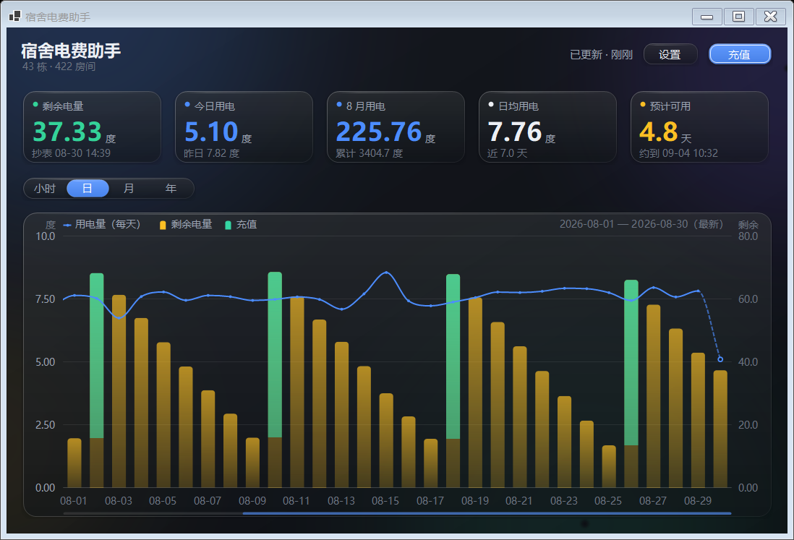
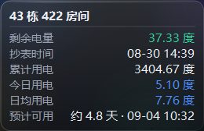
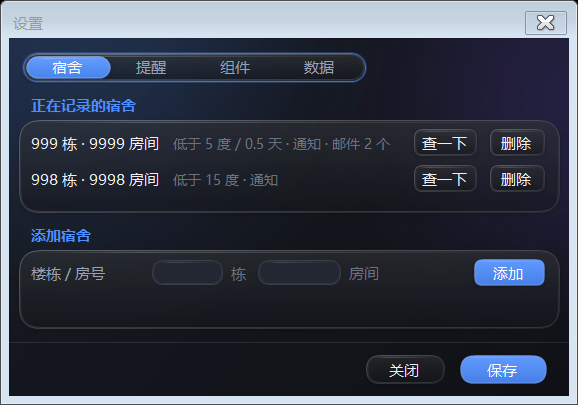
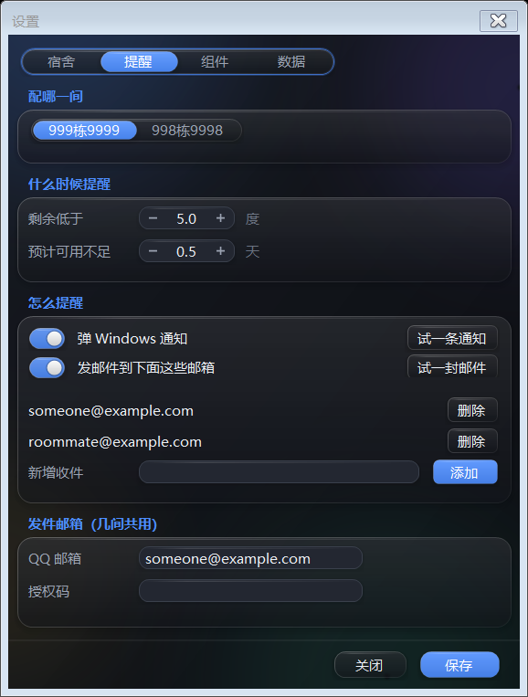
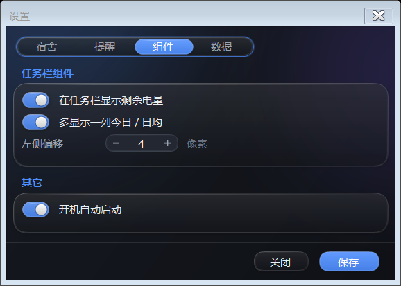
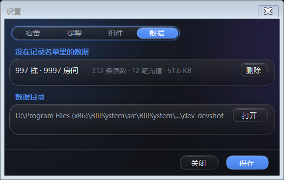
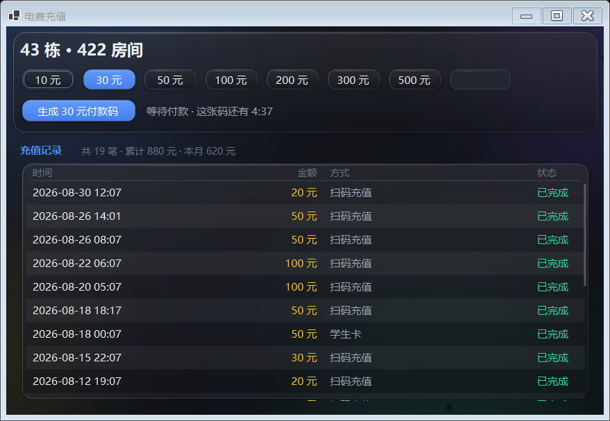
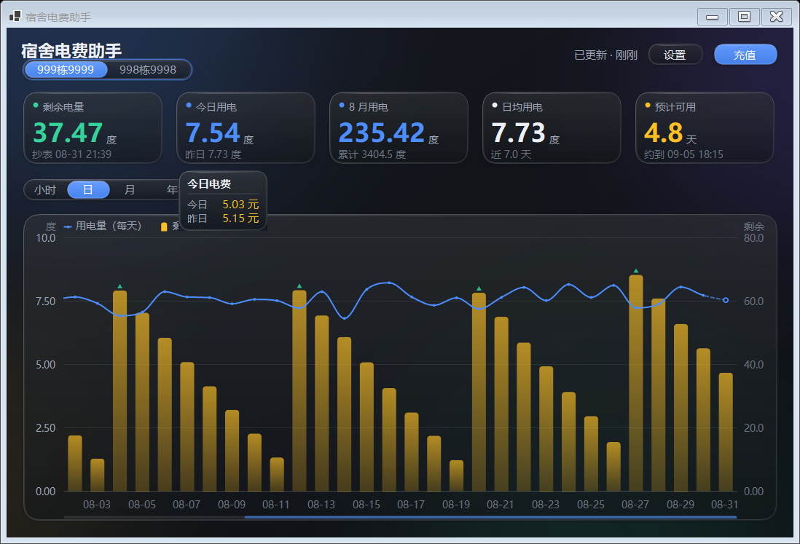
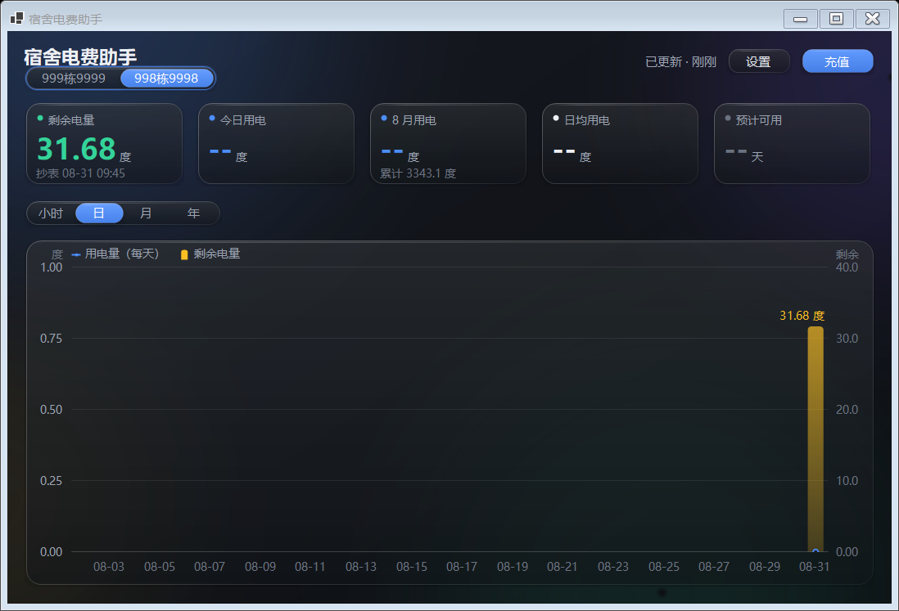

# 宿舍电费助手（BillSystem）

五邑大学宿舍电费查询小工具：任务栏最左侧常显**剩余电量**和网页上那个**抄表时间**，主界面按小时 / 日 / 月 / 年看用电曲线 + 剩余电量柱状图，还能**直接在窗口里扫码充值**。**几间宿舍可以同时记录**，各自攒历史、各自提醒，主界面上一点就切。



任务栏组件长这样（贴在任务栏最左边，两行紧凑读数，**只有字没有底**，底下是真透明的）：


鼠标停上去 0.26 秒弹这张信息卡（自己画的，不是系统气泡）：



设置分四页，**点保存立刻生效，窗口留在原来那一页**，接着改接着存；没存过的改动点关闭就当没发生。

"宿舍"页管在记录哪几间（默认空的，自己加，房号后面那句就是这一间眼下的提醒设置）：



"提醒"页：只有发件邮箱是几间共用的，**什么时候提醒（剩多少度、还能用几天）和怎么提醒（弹不弹通知、发不发邮件、发到哪几个邮箱）都是按间配的**，顶上先选房间：



"组件"页管任务栏那一条，"数据"页列**已经不在记录名单里、文件却还在**的那些历史（删宿舍不会顺手删数据）：




充值窗口：上面一条选金额（也可以直接在最后那格里打数字），下面整块是**当前这一间**的充值记录：



点"生成付款码"弹这个码窗，操作按钮都在码底下——过期了点**换一张**，不付了点**取消这一单**（关掉窗口一样算取消，下次申请拿到的是新的一张）：


## 一、查询接口（对着缴费页面的 JS 包扒出来并实测过）

接口地址和字段名最早是从 [MYHealer/wyu-electricity](https://github.com/MYHealer/wyu-electricity)（一个读同一套接口的 ESP32 小项目）里看到的，之后每一个都自己发请求核对过。

```http
POST http://202.192.240.231/scp-api/electricity-recharge/getCurrentRemaining_v2
Content-Type: application/x-www-form-urlencoded
Referer: http://202.192.240.231/recharge.html

userTypeID=1&building=43&room=422
```

实测返回（2026-08-29）：

```json
{"success":true,"code":10000,"message":"查询成功","data":{
  "id":"2138","schoolId":"1","schoolName":"五邑大学本校区",
  "apartID":"227","apartName":"43栋","roomID":"2410","roomName":"43422",
  "usedamp":3343.10,"resamp":31.68,"status":0,
  "updatedt":"2026-08-29 09:45:36","userTypeID":1,"userTypeName":"学生用电充值"}}
```

| 字段 | 含义 | 网页上的叫法 |
| --- | --- | --- |
| `resamp` | 剩余电量（度） | 剩余电量 |
| `usedamp` | 累计用电（度，只增不减） | 累计用电 |
| `updatedt` | 电表上传读数的时间 | **抄表时间** |
| `building` / `room` | 楼栋号 / 房间号 | 43 / 422 |

字段单位和"抄表时间"这个叫法是对着缴费页面自己的 JS 包核对的，不是猜的。

**注意：这个系统只有"当前值"接口，没有历史用电接口**（把站点 JS 里的 `scp-api/...` 全列出来数过，一共 5 个，都不给历史）。所以历史曲线只能自己攒：程序**每到整点和半点（`:00:00` / `:30:00`）各读一次**，把读到的 `usedamp` / `resamp` 按整点记进 jsonl（半点那一次落回本整点那一格，值变了就顶替掉，没变什么都不做），用电量则是**两次真实抄表（`updatedt` 变了）之间的 `usedamp` 差**，按时间比例摊到中间那几格里。

**为什么不拿相邻整点相减**：电表多久上传一次读数是它自己的事，**间隔忽长忽短**（有时一个钟好几次，有时好几个钟都不动），中间那些整点查到的 `updatedt` 和 `usedamp` 跟上次一模一样。要是拿相邻整点直接相减，就变成"一个钟 2 度、下一个钟 0.00 度"的锯齿。所以程序先把重复读数收拢成一次抄表，再把这一段的增量按时间比例摊到中间那几格里——**算法不假设抄表间隔是多少**，间隔多长都算得对。

**这一格算给谁**：一个整点只存一条，同一个整点重复读就覆盖（`SlotTime` 是主键），半点那一次也算在本整点这一格里。**3:00 抄到的量算 2 点那一格的用电**——它是 2:00~3:00 之间用掉的。所以图表上最右边那格总是"上一个小时"，新读数一进来就现算现画。中间漏了几个整点（程序没开、网断了）时，那一段的用电按小时数平摊回去，不会全堆在补上的那一格里。**软件不开着的时间段只有平摊值，没有真读数**，这也是为什么建议打开开机自启。

## 二、充值接口（同样是从站点 JS 包里扒的，历史记录实测过）

只做**微信扫码**这一路（学生卡那条要读卡器）。三个接口都是 POST，都没有登录态，只认 `Referer: http://202.192.240.231/recharge.html`。

**① 下单拿二维码** —— 这个是 JSON body：

```http
POST http://202.192.240.231/scp-api/electricity-recharge/create-order-cb
Content-Type: application/json

{"mobile":"","building":43,"room":422,"payCent":3000,
 "userTypeId":1,"codeType":"weixin"}
```

返回 `data.orderCode`、`data.qrCode`（要画成二维码的那串 `weixin://wxpay/bizpayurl?pr=…`）、`data.qrCodeExpireTime`（**秒**）。金额单位是**分**，每笔 1~1000 元。注意这个接口的字段是小写 d 的 `userTypeId`，另外两个是 `userTypeID`——照抄就行，别统一。

`mobile` **留空字符串**：这个字段学校那边不校验，扫码付款走的是微信自己那一套，程序不问也不存手机号。字段本身还是要带上（少一个键会直接 400），所以照上面那样给个空串。

**② 查这一单付没付** —— 表单 body：

```http
POST http://202.192.240.231/scp-api/electricity-recharge/check-order-cb
Content-Type: application/x-www-form-urlencoded

orderCode=xxxxxxxx
```

`data.record.payResult`：`0` 还没付 / `1` 已到账 / `2` 失败。程序每 3 秒查一次，付上了立刻查一次电量。

**③ 历史充值记录** —— 表单 body，`period` 这个参数**必须给**，少了直接回 `{"success":false,"code":40000,"message":"分页信息有错"}`：

```http
POST http://202.192.240.231/scp-api/electricity-recharge/orderQueryWithPage
Content-Type: application/x-www-form-urlencoded

building=43&room=422&userTypeID=1&payResult=1&period=1Y%2B&page=1&pageSize=50
```

`period` 就是网页上那四个页签：`3M` / `6M` / `1Y` / `1Y+`，其中 **`1Y+` 是"全部"**，不是"一年以前"。`page` 从 **1** 开始，返回 `data.total` / `data.data[]`，按支付时间倒序，字段是 `orderCode`、`payTime`、`payCent`、`payMethod`（`code` 扫码 / `card` 学生卡）、`payResult`（这里是中文，比如"已完成"）。实测 43 栋 422 一共 123 笔。

二维码是**自己编的**（`Services/QrCode.cs`，字节模式 + 自动选版本 + Reed-Solomon + 8 种掩码挑罚分最低的那个，跟网页一样用 H 档纠错），项目不引第三方包。`--selftest` 里有一份独立写的解码器把画出来的格子反过来解一遍（格式信息 BCH、反掩码、蛇形取码、去交错、RS 校验子 `S_i = C(α^i) == 0`、再解回原文），编码链上哪一步错位都会当场暴露。

## 三、功能

- **几间宿舍一起记**：设置的"宿舍"页里加房号（默认一间都没有），加进来就各自开一份后台轮询、各自一套 jsonl。主界面标题下面那条切换器一点就切，卡片、图表、充值窗口和充值记录跟着一起换；只记一间时那儿不摆切换器，写一行房间名。删掉一间只是不再查了，**已经攒下的 jsonl 一个字都不动**——要清理到"数据"页里手动删。
- **任务栏最左侧常显**：剩余电量 + 抄表时间（可再加一列今日 / 日均），显示的是主界面上正看着的那一间。**只有字，没有底**——窗口是分层窗口（`WS_EX_LAYERED` + `UpdateLayeredWindow`），整块位图连 alpha 一起交给系统合成，笔画之外的地方是真透明的，看着就是任务栏上多了几个字。实现是一个独立置顶小窗，但把自己认到 `Shell_TrayWnd` 名下（owner），位置跟着任务栏窗口的真实矩形走——任务栏自动隐藏或前台是全屏窗口时，它自己挪到屏幕外让开。左键开主界面，右键出菜单。**可以关掉**（设置的"组件"页，或者托盘菜单里那一项，默认开着）。
- **悬停信息卡**：鼠标停在组件上 0.26 秒弹出，列出剩余 / 抄表 / 累计 / 今日 / 日均 / 预计可用，更新失败时多一行红色原因。这张卡是自己画的置顶小窗（鼠标穿透），不用系统 `ToolTip`——组件是 `WS_EX_NOACTIVATE` 的置顶工具窗口，系统气泡会被它压在下面，而且经常根本不触发。触发时机也不靠 `MouseEnter`，而是每 0.25 秒看一眼鼠标在不在组件矩形里。
- **主界面**：五张卡片（剩余电量 / 今日用电 / 本月用电 / 日均用电 / 预计可用天数）+ 图表，卡片、分段选择器、开关、输入框全是自己画的**液态玻璃**（见下）。今日 / 本月 / 日均这三张**鼠标停上去贴一张小窗，把度数折成钱**（今日配昨日、本月配累计、每天配近几天，按 ⅔ 元一度算）：
  
- **粒度**：小时、日、月、年，切换的是"一屏放多少格"（48 小时 / 30 天 / 12 月 / 6 年），不分页。选中的那块**可以按住直接拖**，松手就落到最近的一格（也能照常点）。
- **图表**：整段历史就是一张表，**滚轮或按住拖动左右滑，双击回到最新**（底下有条细滚动条告示现在停在哪儿）。滚轮认的是**鼠标停在哪儿**，不是键盘焦点在哪儿——图表和记录列表都不接焦点，所以滚轮由一个全局消息过滤器按鼠标位置派下去（`UI/Wheel.cs`），刚点过按钮或输入框也照样能滑；鼠标移到图表上会变成左右拖的样子。纵轴按整段历史定标，滑动时柱子高度的比例不变；横轴刻度挑在绝对时间的整数倍上（每 6 小时、每周一……），滑动时标签跟着内容走，不会每滑一格重排一次。**用电量画成一条平滑曲线**（单调三次 Hermite 插值，不是折线也不是会过冲的样条：平摊出来那几格数值一样，曲线就是平的，不会鼓包，也不会在落差大的地方甩到 0 以下），**剩余电量画柱状**（右侧独立坐标轴），鼠标移上去有十字线、整格的浅色底和数值气泡。没采集到数据的时间段是空白，不会假装成 0（最后一次抄表之后的那几个小时同样算"还没数据"，曲线到那里就断，不会掉到底）。**只盖到一半的那一格**（这个小时 / 今天才过了一半，或者最后一次抄表落在格子中间）用电量天然比前面矮一截，所以那一截曲线画成**虚线 + 空心点**，气泡里也写明"这天还没过完"或"这一格只抄到一半"，不会被当成用电量突然掉下去。
- **电价 ⅔ 元一度（0.666…，6 循环）**：学校定的，写在程序里（`AppConfig.PricePerKwh`，写成 `2.0 / 3.0` 而不是抄几位 0.6666——小数点后截断会让"充 60 元该进来 90 度"差出零点几度），设置里没有对应项。有了它，一笔充值就能换算成**充进来多少度**——图表气泡和充值记录里那个度数都是这么来的。
- **充值在柱子顶上点一个小三角，柱子不变色**：小时和日粒度下，充过电的那一格柱顶上方有个绿色小三角，鼠标移上去气泡里写清"充值  60 元 · 90.0 度"（度数是金额 ÷ 电价换出来的）。柱状图本身只表示剩余电量，不拿颜色去标充值——按度数比例填一截绿的话，月粒度下整根柱子都会变绿（一个月充进来的度数差不多总比月底剩下的多），金色的剩余电量反倒看不见了。三角点在哪一格：**充值之后剩余电量往上跳的那一格**（钱是这个钟付的，但要等电表下次上传读数才看得见，跳上去往往是后面某一格的事，所以往后**按抄表次数**找——只看付款之后头两次抄表，剩余电量没动的格子就是还没新读数，跳过；写死"往后 N 格"会在间隔长的时候把三角丢回付款那一格），**挑涨幅离"该充进来多少度"最近的那一格**——光看"涨了没有"会被半路的小波动骗走（电表修正过读数，或者同一段里还有第二笔充值）；都没涨就点在付款那一格。**月和年粒度不点三角**：那一格里往往好几笔，点了也说不清是哪一笔，金额和度数照样写在气泡里。这一屏里一笔充值都没有时，图例上也不摆"充值"那一条。
- **刚装上只有一条抄表记录**也有图：用电量要两条记录相减才算得出来，但剩余电量是实打实的，所以那一天 / 那一月照样画出来，剩余电量画成一个标了数值的点，不是整块空白。
  
- **自动查询**：固定**每到整点和半点（`:00:00` / `:30:00`）**各读一次，读到的数按整点记账（3:00 的读数算 2 点那一格）。半点那一次落在**同一格**上：查到的值变了就顶替掉这一格里原来那条，一样就当没这回事，不写盘也不重画——电表什么时候上传读数说不准，多这一次不会凭空多出数据点，但一上传就能早半小时看到。程序刚启动时也会立刻查一次，这一次落在哪个小时就记在**那个**小时上（23:42 启动查到的记在 23 点，不会借用还没到的 0 点那一格；只有差不到 5 分钟就到下一个整点时才算下一格，为的是兜住轮询早几十毫秒的情况）。没有间隔可调，也没有"手动刷新"按钮——想到的时候点一下反而只会拿到跟上次一样的 `updatedt`。查失败就 1 分钟后重试。
- **充值**：主界面和托盘菜单都能开，充的是**主界面上正看着的那一间**（切了房间，正开着的充值窗口跟着换，手里那一单顺带作废）。选金额（预设 7 档，或者直接在自定义那格里打数字，非空且在 1~1000 元之间就能直接下单，回车也算）→ 点"生成付款码"**弹一个码窗**，二维码底下就是操作按钮 → 手机扫码付。码是限时的（学校那边给几分钟），**过期自动重新下一单换一张新的**，跟网页行为一致，也可以自己点"换一张"；**取消这一单**（或者直接关掉码窗）就作废，重新申请拿到的一定是新的一张。每 3 秒查一次订单，付上了立刻刷一次电量和记录，低电量提醒也跟着解除。**不用填手机号**。窗口**记住上次关掉时摆在哪儿**，下次打开还在那儿（记下的位置要是已经不在屏幕上了——换了显示器、拔了扩展屏——就夹回可见区域）。
- **充值记录**：充值窗口下半部分是**这一间**的全部历史（时间 / 金额 / 方式 / 状态），金额那列**元和折合的度数一起写**（`30 元 · 45.0 度`）。本地存一份 jsonl 所以离线也能翻。开程序时每间对一遍、每次充完对一遍；**在手机上充的也认**——剩余电量突然涨了就顺手同步一次。
- **设置**：分成**宿舍 / 提醒 / 组件 / 数据**四页（顶上一条分段选择器切页，每组一张玻璃卡，组名写在卡外面），所有改动先记在配置副本上，点**保存**才写回、才落盘——**存完窗口不关**，还留在原来那一页上，按钮栏里留一句"已保存 HH:mm"，几间宿舍挨着配的时候不用开一次关一次；没存过的改动点**关闭**或直接关窗口就当没发生。数字框也是自己画的（系统 `NumericUpDown` 在深色主题下那两个小箭头永远是浅色的）：中间能直接打字，两头 `−` / `+` 按住连发，滚轮和上下键也能调。
- **"数据"页管孤立的 jsonl**：列出数据目录里**房号已经不在记录名单里**的那些文件（删过的宿舍，或者从别的机器拷过来的），写清多少条读数、多少笔充值、占多大，一间一个删除按钮，删之前问一句。删宿舍和删数据是两件事，这样手一抖也丢不了历史。
- **低电量提醒走 Windows 通知**：低于阈值时弹一条系统通知（进通知中心，点一下打开主界面），充过电（回到阈值 1.2 倍以上）后才会再提醒下一次。**通知是按间开关的**（默认关），提醒过一次不影响另一间。设置里有个**试一条通知**，可以当场确认系统没把本程序的通知关掉。
- **低电量还能发一封邮件**：走 QQ 邮箱的 SMTP（`smtp.qq.com:587` + STARTTLS），跟系统通知同一个触发条件、同一份"充过电才再提醒"的状态，通知中心没看见也不会漏。触发条件有两个，满足哪个都提醒：**剩余电量低于阈值**，或者**照眼下的日均算预计可用不足设置里那个天数**（后者默认 0，也就是不看这一条；一开空调日均能翻几倍，等跌到阈值可能已经半夜断电了，所以想稳一点就调到 0.5 天上下）。
  **提醒整套按间配，只有发件箱共用**：一个 QQ 授权码只对应一个邮箱，所以发件地址和授权码填一份（"提醒"页最底下那张卡）；**什么时候提醒（两条线，默认 10 度 / 不看天数）、弹不弹通知、发不发邮件、发到哪几个邮箱，是每间各自一套**（开关都默认关、收件人默认空），在"提醒"页顶上先选房间，底下几张卡配的就是那一间——朝南朝北、开不开空调，两间的用法本来就不是一回事。房号后面那句摘要（"宿舍"页）写的就是这一间眼下的设置。旁边有个**试一封邮件**，不用先保存就能当场发一封验证，信里带的是**这一间**眼下的数字和阈值。
  信是 **HTML + 纯文本两份**（multipart/alternative）：手机上打开就是一张卡片，最上面是剩余度数（低于阈值是红的，"快见底"是黄的），底下一行一个数——预计可用（带算出来的用完时间）、日均、今日、本月、累计、抄表时间（带"几小时前"），末尾写清怎么充和眼下的提醒条件。**标题固定是"电量告急！将军救急！"，发件人显示名就是触发那一间的房号**（比如"43栋422"）——手机上弹的邮件通知卡就给这两行，不点开就知道是什么事、是哪个房间；几间宿舍共用一个发件箱，靠这行分得清是谁的电快没了。两种触发条件、连"试一封邮件"都用同一套标题，写死在程序里，设置里没有对应项，正文第一句才区分是度数低还是快见底。认不了 HTML 的客户端退回纯文本那份，内容一样。
  **授权码不是 QQ 密码**：在 QQ 邮箱设置→账号里开启 SMTP 服务后生成的那 16 位。项目不引第三方包，也就没有 `ProtectedData` 之外的加密手段可用，所以它**明文存在 `config.json` 里**——那个文件跟 exe 放在一起，别把整个目录随手发给别人（仓库里的 `.gitignore` 已经把 `data\` 挡在库外）。
- **键盘也能用**：按钮、开关、分段选择器都能 Tab 走到（空格 / 回车按下，分段选择器还认左右方向键和 Home / End），键盘走到的控件外面描一圈亮环——鼠标点出来的焦点不描，免得点哪儿都亮一圈。窗口里的 Tab 顺序是按眼睛看到的先后排的，Esc 关弹窗、主界面 Esc 收进托盘。自绘控件也都报了角色和名字给读屏软件，开关会如实报"勾上了没有"。
- **托盘**：图标颜色跟着电量变（绿 / 黄 / 红），关主窗口只是收起来，后台继续记录。菜单里是打开主界面 / 充值 / 显示任务栏组件 / 设置 / **打开数据目录** / 退出——组件上右键弹的是同一个菜单。
- **界面上不摆操作说明**：能点的地方自己看得出来（按钮上写的就是它干的事），所以像"左键打开主界面 · 右键菜单""用微信扫这张码付款""数据目录 …… 点一下打开"这类小字提醒一概不留，屏幕上的小字只用来说数据、单位和状态。数据目录的入口挪进了托盘菜单。
- **开机自启**：设置里勾上，写 HKCU 的 `Run` 项，带 `--tray` 静默启动。
- **过渡动画**：按钮 / 开关 / 分段选择器的悬停、按下、选中和焦点环，卡片上的数字（新数从当前正在滚的那个数接着滚，不会先跳回旧值），图表的滑动（新读数进来时贴着最右边看的话是滑过去的，不是跳一下），充值记录列表的滚轮，弹窗的淡入，全都是插值过去的。所有动画共用一个 15ms 的计时器，而且只在真的有东西在动的时候才转，界面静止时不占 CPU；窗口没显示出来就直接就位不逐帧算，卡了一下也只当过了 80ms，不会一帧跳到底。主窗口不做整窗淡入——它开着 `WS_EX_COMPOSITED`，再叠一层半透明只会更慢。
  **切宿舍跟切粒度是同一套动效**：整张表重新长一遍、卡片重新铺一遍（换粒度或者换房间才做——点保存把设置抄回来时数据没变，不该白闪一次）。**开关除了点，还能按住把圆点拉过去**，松手落到近的那一头，拖到一半又拖回去就弹回原样；设置里的开关一样是松手才算改、**点保存才真落盘**。**设置换页是两张图交接着淡过去的**（页面高度也跟着滑，底下那条按钮栏贴着长出来的边走），不是先擦掉再摆一遍。

**关于液态玻璃**：整个界面学的是 iOS 26 那套"液态玻璃"——卡片、按钮、分段选择器、开关、输入框、图表面板、气泡都是**半透明的一块玻璃**：底下透出带色斑的柔光背景，上面压一层白色高光、一圈斜着渐变的亮边、顶上一道反光和一层柔和投影，悬停 / 按下时整块"抬起来"（更亮、投影更散）。

GDI+ 没有背景模糊可用，所以不是真去模糊：**每个窗口尺寸只画一张柔光底图**（渐变 + 四团 `PathGradientBrush` 光斑）缓存起来（尺寸按 48 像素向上取整再查缓存，拖着改窗口大小时才不会每挪一像素就重画一张、顺带把缓存冲掉；各处都是原尺寸贴、多出来的部分裁掉），每个控件按自己在窗口里的位置把这张图对应的那一块贴进来，再往上叠玻璃。这样拼接处严丝合缝（不会有一格格的接缝），贴完又是不透明的表面，`TextRenderer` 画的文字照样清晰——它不认 alpha，画在半透明层上会发灰。光斑位置按窗口比例算死，所以 `--screenshot` 每次出的图都一模一样。设置和充值窗口里那几张分组卡是先合成进底图的（`Theme.IBackdropHost`），里面的输入框贴的就是这张合成图。文字标签也全换成了自绘的 `UiLabel`（系统 `Label` 只能填一个实色，摆在柔光底图上就是一块块补丁）。**唯一不上玻璃的是任务栏组件**——它整块是分层窗口，底下是真透明的，要的就是"任务栏上多了几个字"。

嵌了真 `TextBox` 的输入框（授权码、自定义金额、数字框）做不到半透明——里面那个原生控件是不透明的，所以那几块用的是"磨砂实色"：外框和 `TextBox` 同一个底色，只保留亮边和顶上的反光，不叠高光，免得中间露出一道色差。

**关于任务栏组件不闪不丢**，三件事叠起来治：

一是**分层窗口**（`WS_EX_LAYERED` + `UpdateLayeredWindow`，`Interop/Win32.cs` 里的 `PushLayered`）。普通窗口的画面得靠自己收到 `WM_PAINT` 才补，任务栏在上面重画一次就能把它擦没了，得等切个窗口才回来——这就是"闪烁消失甚至长时间不显示"的根子。分层窗口的画面存在 DWM 那边，谁在上面画都擦不掉，也不用去猜背景该填什么色。代价是画字只能走 GDI+ 的 `DrawString`（`TextRenderer` 是 GDI 画的，出来的像素 alpha 一律是 0，推给系统就是一片透明），ClearType 也用不了，所以字底下描了一圈反色淡影顶替。另外整块铺了一层 `alpha=1` 的黑：肉眼看不见，但分层窗口是按 alpha 判定鼠标命中的，真全透明的话只有笔画上点得中。

二是**认到任务栏名下**（`SetWindowLongPtr(GWLP_HWNDPARENT, Shell_TrayWnd)`）。任务栏自己也是置顶窗口，切换前台窗口的一瞬间它会跳到所有置顶窗口前面，把组件盖住；认了 owner 之后系统保证窗口画在自己 owner 的上面，任务栏被抬到最前时组件是跟着一起上来的，根本没有"被盖住"这一帧。位置也只在真实矩形跟目标不一致时才 `SetWindowPos`（原来每 5 秒会强制重设一次，那一下就是闪的来源）。

三是**自己盯着有没有被埋**：每 0.25 秒拿组件正中那一点问一次 `WindowFromPoint`（正好用得上上面那层 `alpha=1`），埋着就立刻顶回去；连着两秒顶不动就说明"认 owner"这条路在这台机器上不好使（Win11 任务栏改版频繁），干脆松开、退回定时抢 Z 序。owner 被销毁时它名下的窗口会跟着销毁，所以 explorer 重启后会发现自己的句柄没了，重新建窗口再认一次。

## 四、编译、运行和打包

需要 .NET 8 SDK，没有任何 NuGet 依赖。

```bat
build.bat            :: 等于 dotnet build -c Release
run.bat              :: 编译并启动
publish.bat          :: 打包正式发布版（自带运行时，见下）
```

或者直接：

```bash
cd src/BillSystem
dotnet build -c Release
bin/Release/net8.0-windows/BillSystem.exe
```

**打包发布**：`publish.bat` 出来的 `publish\BillSystem\` 就是**可以直接压成 zip 发出去的那个文件夹**——它是自带 .NET 8 运行时的（`--self-contained`，win-x64），对方解压后双击里面的 `BillSystem.exe` 就能用，不用装运行时、不用装 SDK。整包 150 MB 上下，压成 zip 六七十兆，传 GitHub Release 没问题。**别把 `data\` 一起压进去**（那是本机攒的历史和明文授权码，`.gitignore` 和打包目录里都不该有它）；升级时把旧的 `data\` 拷进新文件夹就接着用。

命令行开关：

| 开关 | 用途 |
| --- | --- |
| `--tray` | 静默启动，不弹主窗口（开机自启用的就是它） |
| `--selftest` | 跑用电换算、配置读写和二维码编码的自检，结果写 `%TEMP%\billsystem-selftest.txt`，退出码 = 失败项数 |
| `--screenshot [目录]` | 开发出图：用假数据把主窗口（日 / 小时 / 月，外加"只有一条记录"）、任务栏组件、悬停信息卡、设置四页、充值窗口和付款码窗渲染成 12 张 PNG（离屏画，不截屏），再把两种触发条件下的提醒邮件各写一份 `mail-*.html`（浏览器直接开就能看排版），默认写 `%TEMP%\billsystem-shots` |

后面两个开关都在 exe 旁边开一个自己的沙盒数据目录（`dev-selftest\` / `dev-devshot\`），**碰不到 `data\` 里的真实记录和 `config.json`**，出的图里也全是假房号假邮箱。

## 五、数据放在哪

**跟着程序走**：exe 旁边的 `data\` 目录（绿色版，整个文件夹拷走就带走了历史）。

- `config.json` —— 在记录哪几间（`Dorms`，每间带自己的两条提醒线 `LowThreshold` 度数阈值 / `LowDaysThreshold` 预计可用天数、通知 / 邮件开关和收件人）、正看着哪一间、共用的发件箱和授权码（`MailFrom` / `MailAuthCode`，**明文**）、组件开关和位置、粒度
- `readings-B43-R422.jsonl` —— **一间一个文件**，文件名里就是房号。一行一条整点读数，按 `SlotTime` 认格子（半点那一次也落在本整点这一格）。**读到的跟这一格已有的一模一样就不写新行**（电表隔多久上传一次说不准，同一格里反复查到的值往往完全相同），值变了才追加一行、载入时后写的赢；**启动载入完还会把文件收拢成一格一行**，多出来的重复行和坏行一并清掉（先写临时文件再整体替换）。所以文件行数和图表上的格子数是对得上的。载入时整点一律按 `FetchedAt` 重算，老版本盖错的章会自动纠回来
- `recharges-B43-R422.jsonl` —— 同样一间一个。一行一条充值记录，按订单号去重，学校那边的全量副本。**文件里按时间正序**（最早的在第一行，最新的在最后一行），跟上面那个读数文件一样，自己翻的时候顺着读下来就是时间顺序；界面上的列表反过来排，最近一笔在最上面。合并进来的可能是比现有记录更早的（第一次拉全量就是），所以每次同步都把整份重写一遍，不是往后追加；老版本留下的倒序文件在载入时自动理顺
- `error.log` —— 崩了才有

装在没有写权限的目录里（比如真的装进 `C:\Program Files`）时，退回 `%APPDATA%\BillSystem\`。

**删宿舍不删文件**：设置里把一间删掉只是不再查了，那两个 jsonl 留在原地；要清理到设置的"数据"页里手动删。把别的机器上的 `readings-B*-R*.jsonl` 拷进这个目录，再到设置里把那个房号加回来，历史就接上了。

## 六、几个要知道的前提

1. **必须连校园网**（或校园 VPN），`202.192.240.231` 是校内地址。查不通时组件右上角有个红点，主界面右上角写明失败原因。
2. **学校抄表本身是几小时一次**。程序每个整点和半点各读一次，但 `updatedt` 常常几个小时都不变——读得再勤也不会更细，所以也就没做手动刷新。
3. 因此**小时级用电是估算**：把两次抄表之间的用电量按时间比例摊到这几个小时里，所以相邻两个小时不会出现"一格满一格零"。日 / 月 / 年 的数字不受影响。
4. 累计读数变小（换表、清零）时那一段按 0 用电处理，不会出现负数。
5. **邮件提醒要自己去 QQ 邮箱开 SMTP 并生成授权码**，连同发件地址和这一间的收件人填进设置里才发得出去；那串授权码明文存在 `config.json` 里。
6. **接口是学校的，房号也是自己填的**：程序只是照着缴费页面的接口按房号查数、下单，查得到什么全看那边给什么；填错房号就是查不到，程序不会替你猜。

## 七、代码结构

```
src/BillSystem/
  Program.cs            入口：单实例、异常兜底、命令行开关、开发沙盒目录
  TrayContext.cs        程序主体：托盘 + 组件 + 主窗口 + 每间一份轮询 + 充值记录同步
  Models/
    Dorm.cs             一间宿舍：房号 + 这一间自己的两条提醒线、通知 / 邮件开关和收件人
    AppConfig.cs        配置（宿舍名单、共用的发件箱、组件、粒度）+ 读写
    Reading.cs / RechargeRecord.cs / Fmt.cs / Enums.cs
  Services/
    ElectricityApi.cs   上面那个查询接口
    RechargeApi.cs      充值三件套：下单 / 查单 / 历史分页
    QrCode.cs           自己实现的二维码编码器（字节模式 + RS 纠错 + 掩码）
    DormSession.cs      一间宿舍跑起来的样子：两个仓库 + 一份轮询 + 提醒去重的状态
    DormFiles.cs        数据目录里按房号归拢的 jsonl（"数据"页列孤立文件、删文件）
    ReadingStore.cs     jsonl 存取（整点为主键、同格覆盖、载入时收拢重复行）
    RechargeStore.cs    充值记录的本地副本（按订单号去重、合并、文件按时间正序整份重写）
    UsageAggregator.cs  累计读数 → 各粒度用电量（核心换算：按抄表区间摊）
    PollService.cs      后台轮询（掐着整点和半点 :00:00 / :30:00，失败 1 分钟后重试）
    MailAlert.cs        低电量那封 QQ 邮箱通知（SMTP 587 + STARTTLS，HTML + 纯文本两份）
    Startup.cs          开机自启注册表项
  Interop/Win32.cs      任务栏定位、认 owner、置顶、前台钩子、分层窗口合成的 P/Invoke
  UI/
    Anim.cs             会自己平滑追到目标值的量，所有过渡动画都靠它（共用一个计时器）
    Fade.cs             弹窗淡入（挂在 Form 上，主窗口不用）
    Wheel.cs            滚轮按鼠标位置派给底下那个控件，不跟键盘焦点走（全局消息过滤器）
    TaskbarWidget.cs    任务栏最左侧那一条
    WidgetTip.cs        组件的悬停信息卡（自己画的置顶小窗）
    MainForm.cs         主界面（含宿舍切换器）
    CardTip.cs          卡片上"折成多少钱"的那张小窗（主窗口的子控件，不是独立窗口）
    ChartControl.cs     自己用 GDI+ 画的图表（用电曲线 + 剩余柱状，一张长表 + 滚轮 / 拖动）
    SettingsForm.cs     设置四页：宿舍 / 提醒 / 组件 / 数据（改副本，保存写回、窗口不关）
    PageSwap.cs         换页时那层交接图（前后各截一张，淡过去完就自己拆掉）
    RechargeForm.cs     充值窗口（选金额、下单、历史，跟着主界面换房间）
    QrDialog.cs         付款码弹窗（码 + 底下的换一张 / 取消）
    QrView.cs           画二维码的小控件（整数像素、不抗锯齿，好扫）
    RecordList.cs       充值记录列表（自己画的，带滚动和悬停）
    StatCard.cs / UiButton.cs / UiSpin.cs / UiText.cs / UiLabel.cs / Segment.cs / UiToggle.cs / Glyphs.cs
    Theme.cs            配色 + 液态玻璃那几块画法（柔光底图缓存、玻璃、反光、投影、焦点环）
  Dev/                  只在命令行开关下用得到的三个文件，正常运行时一行都不跑
    SelfTest.cs         --selftest（用电换算 + 抄表区间摊分 + 整点记账 + 轮询节奏 + 仓库覆盖语义
                        + 电价换算 + 充值标格 + 充值记录去重与文件顺序 + 接口解析 + 配置读写
                        + 按间的提醒邮件 + 孤立文件识别）
    QrSelfTest.cs       --selftest 里那份独立的二维码解码器
    DevShot.cs          --screenshot
```

`UsageAggregator` 是最值得先看的一块：所有图表数字都从那里出来，改动前最好先跑 `--selftest`。

## 八、许可

[MIT](LICENSE)。接口那部分是对着学校自己的缴费页面扒出来并实测的，只读自己的房号；拿去改、拿去发布都行，但**别把 `data\config.json` 和你的授权码传上去**。

